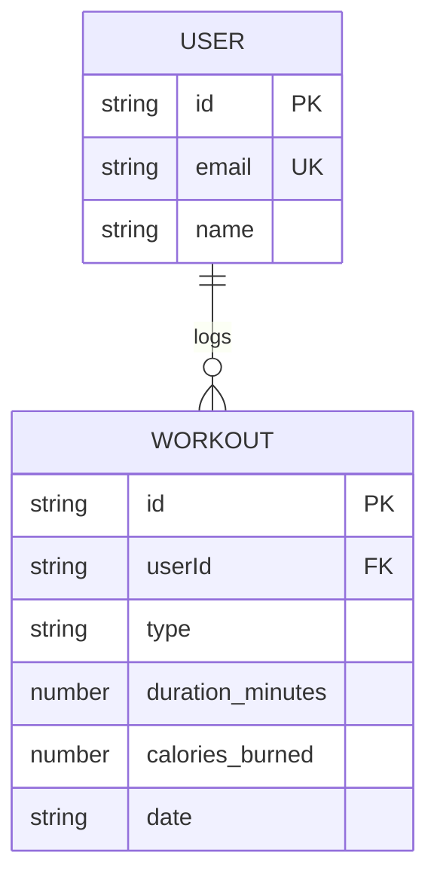

# FitTrack Data Model

## Entity Relationship Diagram (ERD)

## Entities & Fields

### 1. User

- **id**: Unique string identifier.
- **email**: Used as the mock login to identify the user.
- **name**: Display name for the dashboard.

### 2. Workout

- **id**: Unique string identifier for the workout.
- **userId**: Links the workout to a specific user's ID.
- **type**: Category of exercise (e.g., "Running", "Cycling").
- **duration_minutes**: Total time of the workout.
- **calories_burned**: Total calories burned.
- **date**: The date the workout happened.

## Constraints & Assumptions (MVP Simplifications)

1. **Local Storage Architecture:** We are not using a backend database (like SQL or MongoDB). All data is persisted locally as JSON arrays.
2. **Mock Authentication:** Because data is local, "login" simply involves entering an email to set the active user session. No passwords, hashes, or secure tokens are required for the MVP.
3. **No Granular Metrics:** We are tracking high-level stats (duration/calories), not individual sets, reps, or weights.
4. **Permanent Deletion:** We are ignoring soft-deletion (archiving). Deleting a workout permanently removes it from local storage.
